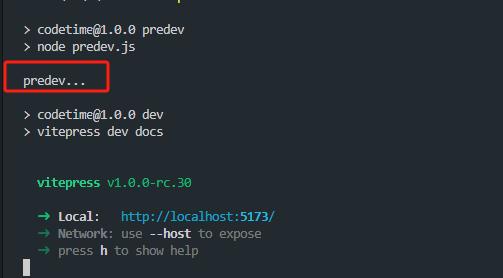

# 启动npm run

## npm run dev 运行过程中发生了什么

## 执行过程：
- 从当前项目node_modules/.bin查找可执行命令vite
- 没有，则从全局node_modules查找vite命令
- 没有，从环境变量中查找
- 没有，则报错


- /bin/sh 提供给linux nuix macOs使用
- .cmd windows的cmd使用
- ps1 给widnows的powershell使用
## npm run 生命周期
执行步骤:
- npm run dev --> npm run predev --> npm run postdev
- npm run predev:在dev之前做一些预处理工作。例如：安装依赖、清理项目、生成配置。
- npm run postdev:在dev之后做一些处理任务。例如：生成报告、部署项目。根据具体需求定制。
::: code-group
``` sh[npm run ]
"predev":"node predev.js"
"dev": "vitepress dev docs",
"postdev":"node postdev.js"
```
:::

输出


